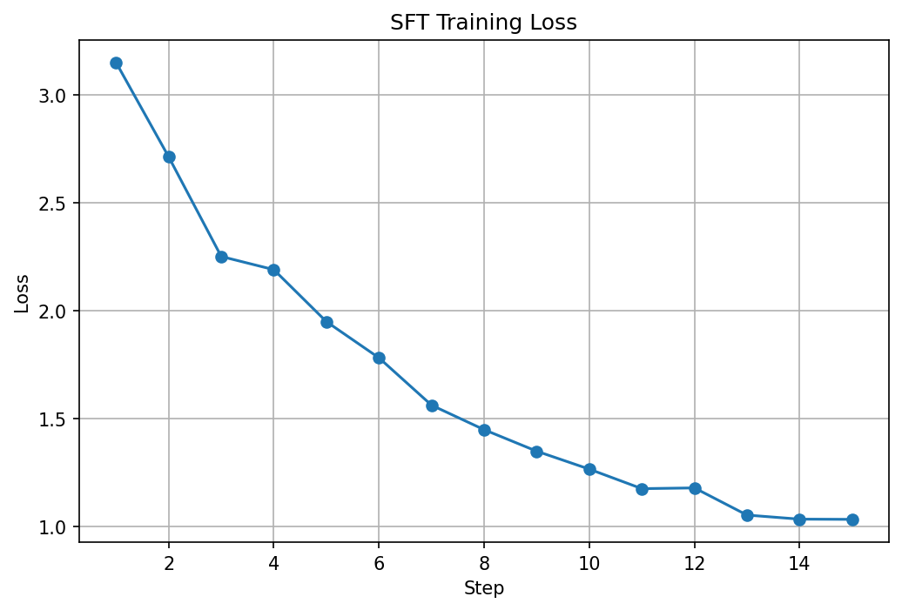
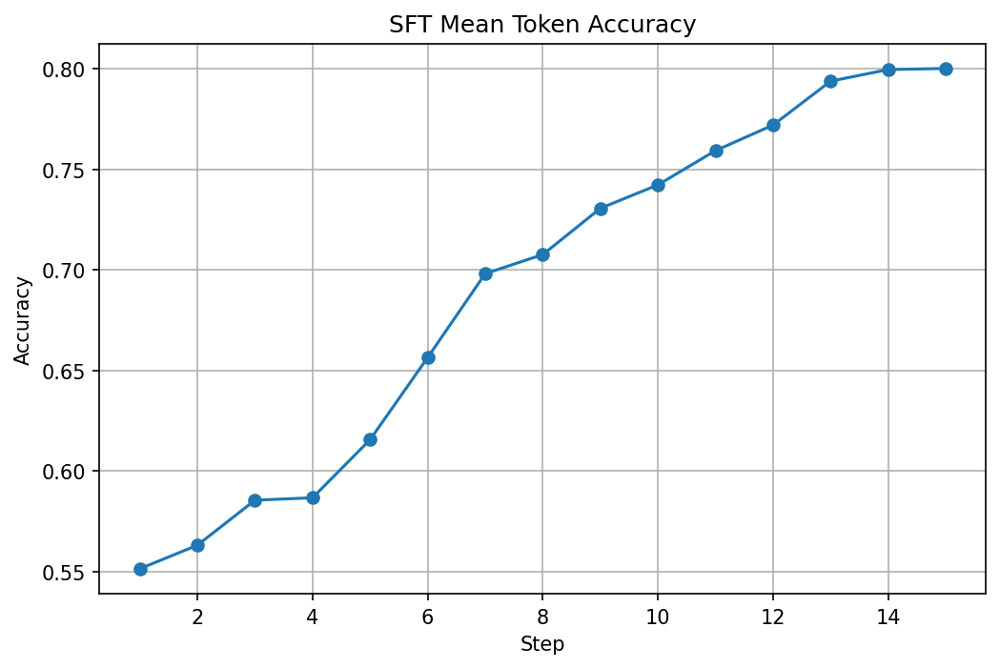
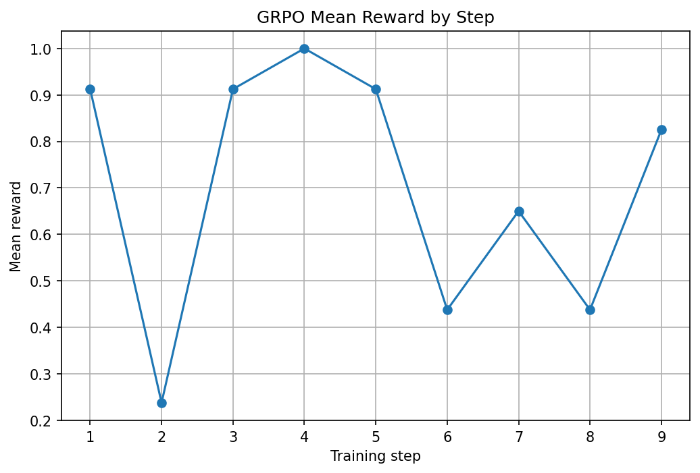
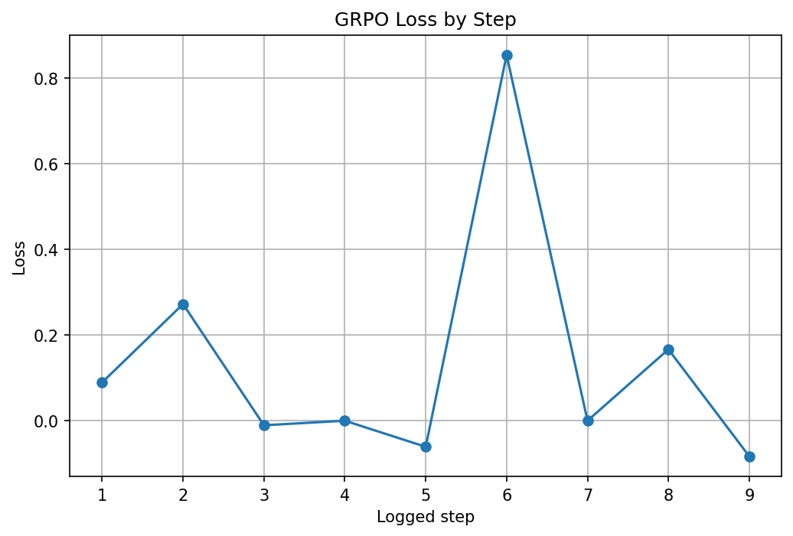

#  jiRL --> Teaching Models to Investigate Like Engineers 

Every engineering team says they move fast. But in reality, a huge amount of time is lost solving the same bug twice.
That was the pain point that inspired our project.

At Qualcomm, we deal with tens of thousands of Jira tickets every single day. The real challenge is often not debugging a new issue from scratch; it is figuring out whether that issue has already been seen, already been solved, or is secretly linked to an older incident.

In practice, this is painfully hard. A Jira may reference an Outlook thread. That thread may point to another Jira. That Jira may only be a bridge to a third Jira where the actual fix lives. Engineers spend hours following these fragmented trails manually.

This causes them to lose a lot of time and effort just to identify issues that have been seen previously.

A Jira can typically take nearly 3 times longer to triage because most tickets are not truly new problems. They are duplicates, regressions, or variations of older incidents. Yet current models still struggle to solve this reliably, because the task is not just retrieval; it is multi-step reasoning across messy, linked enterprise data.

That is exactly the problem we decided to tackle.To solve this humongous time issue and get good accuarcy in current models, we present to you
 ## **"jiRL"**
 a real world openenv trained on dynamic data and parameters which gives your LLM the capability to detect all duplicate jiras

## What We Built

We built a realistic OpenEnv environment that trains and evaluates an LLM to investigate Jira tickets the way a real engineer would approach them.

Instead of asking the model to simply classify a ticket, our environment requires it to:

- search for evidence
- inspect Jira records
- open Outlook threads
- follow multi-hop chains
- decide on a final conclusion

## Hidden Ground Truth, Real Investigation

What makes this especially powerful is that we modeled the problem around real-world failure patterns. In other words, we did not simplify the problem; we captured the messy reality engineers deal with every day. On top of that, we built a hidden ground-truth dataset with rich Jira and Outlook link structures. Each task exposes only a visible slice of that world.

The model cannot see the answer directly; it has to earn it by interacting with the environment. This was a deliberate choice, because in the real world, engineers never have the full answer handed to them. They have to investigate.

## How We Grade the Agent

The most important part of our project is how we grade that investigation. We do not reward the model just for guessing the final answer correctly. We reward it for getting the correct answer using the correct evidence path. Search results are treated only as hints, not proof. The model must open records, follow references, and build a justified resolution chain.

Our grader evaluates six dimensions:

1. correctness
2. evidence sufficiency
3. path validity
4. note quality
5. efficiency
6. contradiction handling

This matters because a model that gets lucky once should not score the same as a model that reasons correctly and consistently. By designing the environment this way, we created a benchmark that teaches real incident-triage behavior instead of shallow pattern-matching.

## Supervised Fine-Tuning

To teach the model the basic mechanics of investigation, we first use supervised fine-tuning (SFT). We construct training examples from environment episodes where each sample includes the structured observation and the next correct action the agent should take.

That means the model is not just learning labels. It is learning action patterns such as:

- when to search Jira first
- when to open Outlook evidence
- when to follow a bridge record
- when a duplicate resolution is justified
- when more information is still needed

This gives the model a strong behavioral prior before reinforcement learning begins. In practical terms, SFT teaches the agent how to act like a careful investigator before we ask it to optimize under reward.

### SFT Training Curves

The training curves below give a quick visual snapshot of how supervised fine-tuning behaved during training.

SFT loss curve

This plot shows how the training loss changes over time. A generally downward trend is a useful sign that the model is learning the supervised action patterns in the dataset rather than failing to fit the task at all.

SFT mean token accuracy

This plot shows how often the model predicts the expected training tokens correctly. It is not the same as solving the full environment, but it is a useful early indicator that the model is learning the structure of valid tool actions and responses.

## RL Post-Training

After SFT, we use reinforcement learning post-training to improve how the model behaves inside the environment. This stage is important because real triage is not only about producing a plausible next action; it is about reaching the right conclusion through the right sequence of evidence-gathering steps.

That is where the environment becomes especially valuable. The model interacts with the Jira and Outlook tools, receives rewards from the grader, and gradually learns which behaviors are actually useful.

### GRPO Training Curves

The GRPO plots below show how reward and optimization behavior evolved during post-training on top of the SFT checkpoint.

GRPO reward curve

This plot shows the mean reward by GRPO training step. Higher values suggest the model is generating actions that score better under the structural reward function used during post-training.

GRPO loss curve

This plot shows the GRPO loss over training steps. It helps indicate whether optimization is proceeding in a stable direction while the model adapts from supervised behavior to reward-guided behavior.

## Why It Matters

### What started as an internal productivity pain point became a broader challenge worth solving: giving language models the ability to investigate like engineers, not just answer like search engines.
