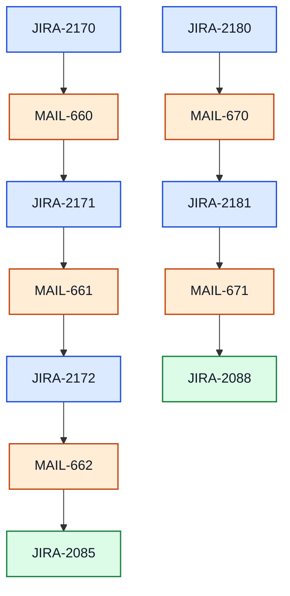
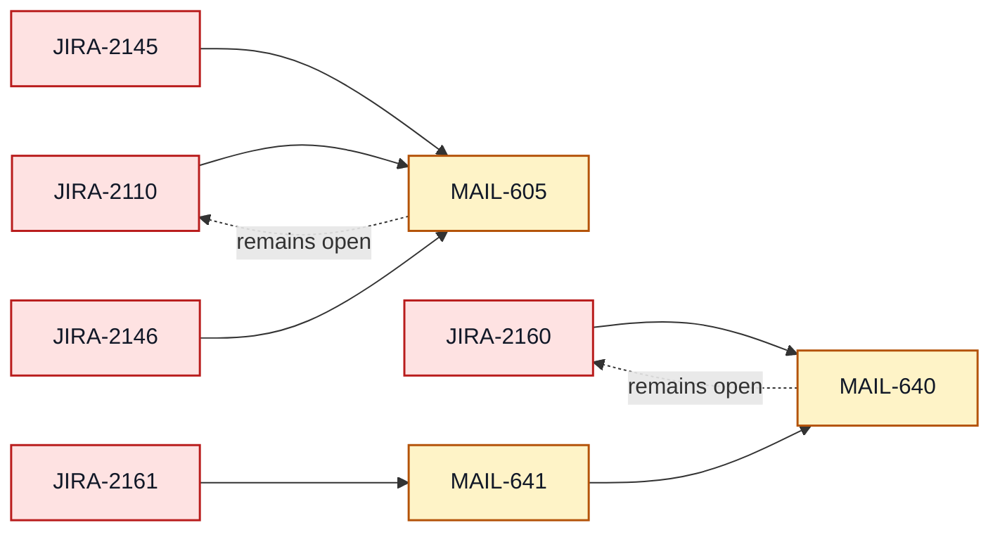

# Jira-Outlook Robust Case Graph

This document visualizes the dependency structure in `jira_outlook_robust_case.json` in a clearer way.

## Legend

- **Blue Jira nodes** = Jira tickets
- **Orange Mail nodes** = Outlook mail threads
- **Green Jira nodes** = final resolved Jira targets
- **Red dashed links** = open investigation / unresolved dependency
- **Solid links** = directed dependency flow

## High-Level Dependency Graph

```mermaid
flowchart LR

  classDef jira fill:#dbeafe,stroke:#1d4ed8,color:#111827,stroke-width:1.5px;
  classDef mail fill:#ffedd5,stroke:#c2410c,color:#111827,stroke-width:1.5px;
  classDef resolved fill:#dcfce7,stroke:#15803d,color:#111827,stroke-width:1.5px;
  classDef open fill:#fee2e2,stroke:#b91c1c,color:#111827,stroke-width:1.5px;

  %% ---------------------------
  %% 1. Notification preference chain
  %% ---------------------------
  subgraph S1["1. Notification Preference Duplicate Chain"]
    J2104["JIRA-2104"] --> M610["MAIL-610"]
    M610 --> M598["MAIL-598"]
    M598 --> J2044["JIRA-2044"]
  end

  %% ---------------------------
  %% 2. Tax mismatch many-to-one + fan-in
  %% ---------------------------
  subgraph S2["2. Shared Tax Mismatch Resolution"]
    J2090["JIRA-2090"] --> M602["MAIL-602"]
    J2140["JIRA-2140"] --> M602
    J2141["JIRA-2141"] --> M602
    M650["MAIL-650"] --> M602
    M651["MAIL-651"] --> M602
    M602 --> J2015["JIRA-2015"]
  end

  %% ---------------------------
  %% 3. Open invoice footer dependency
  %% ---------------------------
  subgraph S3["3. Open Invoice Footer Investigation"]
    J2110["JIRA-2110"] --> M605["MAIL-605"]
    J2145["JIRA-2145"] --> M605
    J2146["JIRA-2146"] --> M605
    M605 -. open thread .-> J2110
  end

  %% ---------------------------
  %% 4. Finance multi-hop resolution
  %% ---------------------------
  subgraph S4["4. Loyalty Finance Multi-Hop Resolution"]
    J2122["JIRA-2122"] --> M620["MAIL-620"]
    J2150["JIRA-2150"] --> M620
    J2151["JIRA-2151"] --> M620
    M620 --> M621["MAIL-621"]
    M621 --> M622["MAIL-622"]
    M622 --> J2050["JIRA-2050"]
  end

  %% ---------------------------
  %% 5. Certificate rotation chain
  %% ---------------------------
  subgraph S5["5. Webhook Certificate Rotation Chain"]
    J2130["JIRA-2130"] --> M630["MAIL-630"]
    J2155["JIRA-2155"] --> M630
    M630 --> M631["MAIL-631"]
    M631 --> J2072["JIRA-2072"]
  end

  %% ---------------------------
  %% 6. Open digest notification dependency
  %% ---------------------------
  subgraph S6["6. Open Digest Notification Investigation"]
    J2160["JIRA-2160"] --> M640["MAIL-640"]
    J2161["JIRA-2161"] --> M641["MAIL-641"]
    M641 --> M640
    M640 -. open thread .-> J2160
  end

  %% ---------------------------
  %% 7. Alternating deep chain A
  %% ---------------------------
  subgraph S7["7. Alternating Deep Chain A"]
    J2170["JIRA-2170"] --> M660["MAIL-660"]
    M660 --> J2171["JIRA-2171"]
    J2171 --> M661["MAIL-661"]
    M661 --> J2172["JIRA-2172"]
    J2172 --> M662["MAIL-662"]
    M662 --> J2085["JIRA-2085"]
  end

  %% ---------------------------
  %% 8. Alternating deep chain B
  %% ---------------------------
  subgraph S8["8. Alternating Deep Chain B"]
    J2180["JIRA-2180"] --> M670["MAIL-670"]
    M670 --> J2181["JIRA-2181"]
    J2181 --> M671["MAIL-671"]
    M671 --> J2088["JIRA-2088"]
  end

  class J2104,J2090,J2140,J2141,J2110,J2145,J2146,J2122,J2150,J2151,J2130,J2155,J2160,J2161,J2170,J2171,J2172,J2180,J2181 jira;
  class M610,M598,M602,M605,M620,M621,M622,M630,M631,M640,M641,M650,M651,M660,M661,M662,M670,M671 mail;
  class J2044,J2015,J2050,J2072,J2085,J2088 resolved;
```

---

## Clean Path View

### Easy paths
- `JIRA-2090 -> MAIL-602 -> JIRA-2015`
- `JIRA-2140 -> MAIL-602 -> JIRA-2015`
- `JIRA-2141 -> MAIL-602 -> JIRA-2015`
- `JIRA-2130 -> MAIL-630 -> MAIL-631 -> JIRA-2072`

### Medium paths
- `JIRA-2104 -> MAIL-610 -> MAIL-598 -> JIRA-2044`
- `JIRA-2155 -> MAIL-630 -> MAIL-631 -> JIRA-2072`
- `MAIL-650 -> MAIL-602 -> JIRA-2015`
- `MAIL-651 -> MAIL-602 -> JIRA-2015`

### Hard paths
- `JIRA-2122 -> MAIL-620 -> MAIL-621 -> MAIL-622 -> JIRA-2050`
- `JIRA-2150 -> MAIL-620 -> MAIL-621 -> MAIL-622 -> JIRA-2050`
- `JIRA-2151 -> MAIL-620 -> MAIL-621 -> MAIL-622 -> JIRA-2050`
- `JIRA-2161 -> MAIL-641 -> MAIL-640 -> open JIRA-2160`
- `JIRA-2170 -> MAIL-660 -> JIRA-2171 -> MAIL-661 -> JIRA-2172 -> MAIL-662 -> JIRA-2085`
- `JIRA-2180 -> MAIL-670 -> JIRA-2181 -> MAIL-671 -> JIRA-2088`

---

## Focused Alternating Jira-Mail-Jira Chains

---

## Open Investigation Graph

---

## Relationship Table

| Start Node | Chain | Final State |
|---|---|---|
| JIRA-2104 | MAIL-610 → MAIL-598 | JIRA-2044 resolved |
| JIRA-2090 | MAIL-602 | JIRA-2015 resolved |
| JIRA-2140 | MAIL-602 | JIRA-2015 resolved |
| JIRA-2141 | MAIL-602 | JIRA-2015 resolved |
| JIRA-2110 | MAIL-605 | open investigation |
| JIRA-2145 | MAIL-605 | open JIRA-2110 |
| JIRA-2146 | MAIL-605 | open JIRA-2110 |
| JIRA-2122 | MAIL-620 → MAIL-621 → MAIL-622 | JIRA-2050 resolved |
| JIRA-2150 | MAIL-620 → MAIL-621 → MAIL-622 | JIRA-2050 resolved |
| JIRA-2151 | MAIL-620 → MAIL-621 → MAIL-622 | JIRA-2050 resolved |
| JIRA-2130 | MAIL-630 → MAIL-631 | JIRA-2072 resolved |
| JIRA-2155 | MAIL-630 → MAIL-631 | JIRA-2072 resolved |
| JIRA-2160 | MAIL-640 | open investigation |
| JIRA-2161 | MAIL-641 → MAIL-640 | open JIRA-2160 |
| JIRA-2170 | MAIL-660 → JIRA-2171 → MAIL-661 → JIRA-2172 → MAIL-662 | JIRA-2085 resolved |
| JIRA-2180 | MAIL-670 → JIRA-2181 → MAIL-671 | JIRA-2088 resolved |
| MAIL-650 | MAIL-602 | JIRA-2015 resolved |
| MAIL-651 | MAIL-602 | JIRA-2015 resolved |

---

## Recommended Reading Order

If someone wants to inspect the most complex cases first:

1. `JIRA-2170`
2. `JIRA-2180`
3. `JIRA-2122`
4. `JIRA-2161`
5. `JIRA-2104`

These cover:
- alternating Jira-Mail-Jira-Mail reasoning
- long mail-only chains
- unresolved open-thread dependencies
- shared-mail fan-in patterns